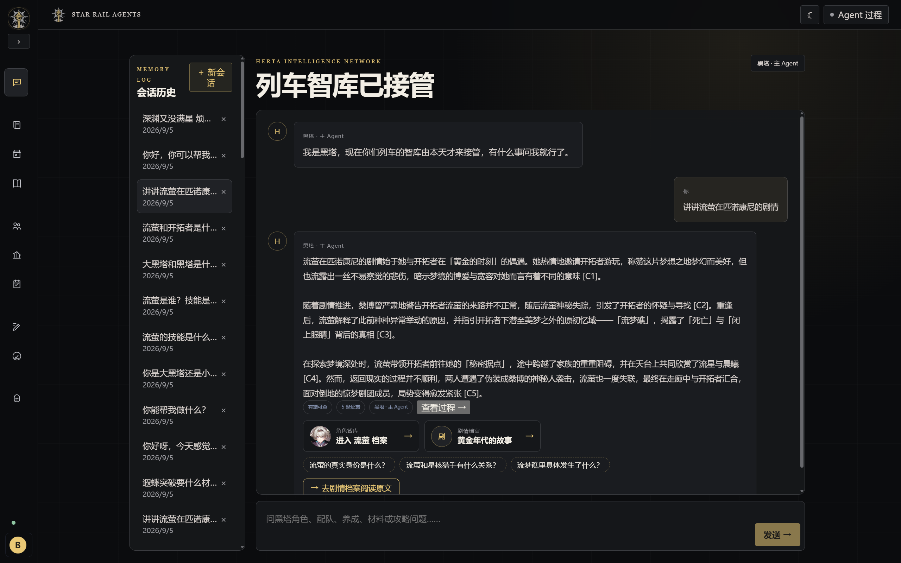
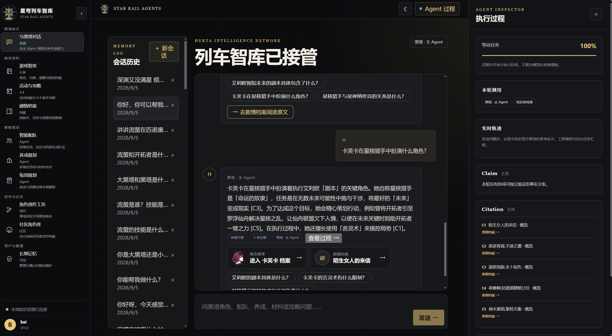
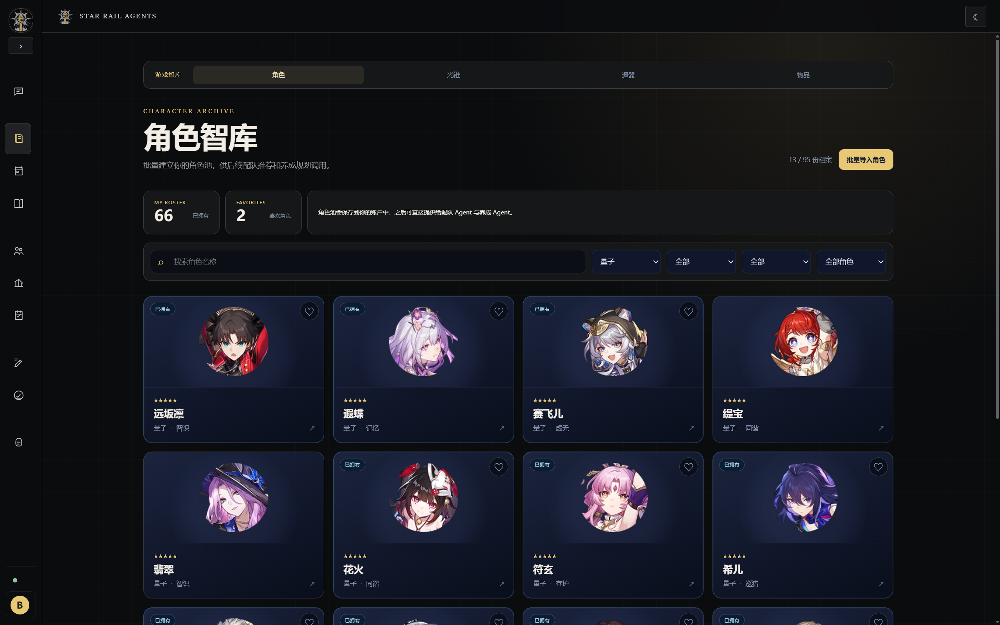
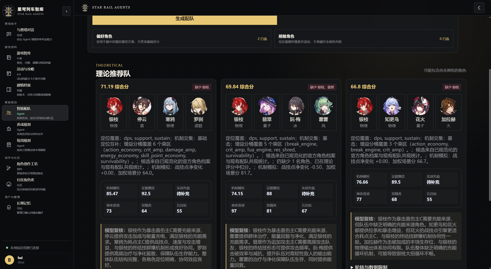
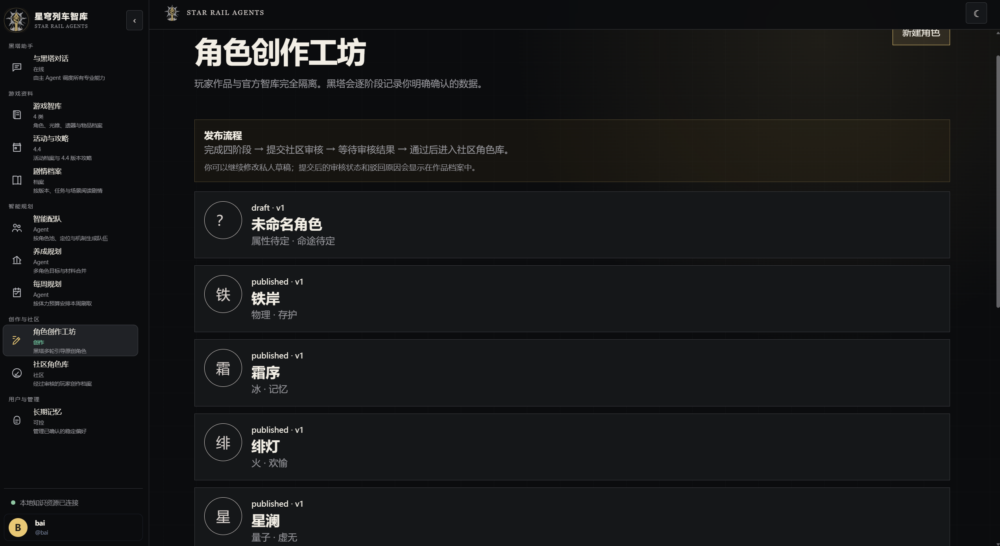
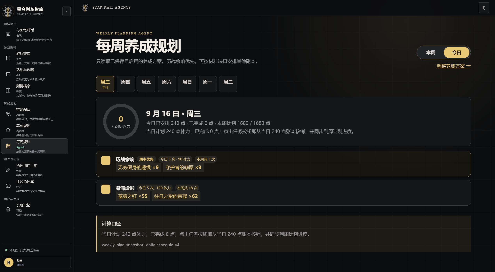

# 星穹列车智库（Star Rail Agents）

基于 Vue 3、TypeScript、FastAPI、LangChain、Milvus、BGE-M3 与多智能体架构的《崩坏：星穹铁道》游戏智能助手毕业设计。

黑塔主 Agent 负责任务编排：现役链路使用原生 Function Calling，最多执行 8 轮决策，并统一注册 10 项领域工具；JSON-ReAct 保留为兼容回退。工具覆盖角色档案、材料、RAG 问答、机制配队、养成、每周体力规划、活动攻略、玩家角色创作与创作自查。工具结果携带引用，主 Agent 返回 Validation 与 Filtering 审计元数据；玩家创作内容与官方知识库保持隔离。

<p align="center">
  
</p>

<p align="center"><em>黑塔主 Agent：统一调度知识检索、剧情解析、配队、养成与规划能力。</em></p>

## 1. 当前可演示功能

| 模块 | 主要能力 | 是否需要登录 |
| --- | --- | --- |
| 黑塔助手 | 多轮对话、意图识别（glm-4.7 专用档）、机制知识问答、RAG 引用、后台任务、Agent 执行轨迹、衍生问题追问按钮、长对话渐进摘要、系统能力自述 | 可选 |
| 游戏智库 | 角色、光锥、遗器、物品列表与详情、图片和关联跳转 | 否 |
| 智能配队 | 机制知识驱动评分（图鉴角色机制画像 + 需求满足判定 + 体系增益价值），官方存储队整队注入与等价类变体，混沌回忆/虚构叙事/末日幻影模式加权，可保存 | 是 |
| 养成规划 | 多角色等级与技能材料计算、材料合并、方案保存与删除 | 是 |
| 每周规划 | 根据启用的养成方案和体力预算安排周本与材料副本，可一键切换今日视图（每日 240 点体力按优先级分配，历战余响恒置顶） | 是 |
| 长期记忆 | 管理已确认的玩法、资源和回答偏好 | 是 |
| 剧情档案 | 任务筛选、场景阅读、剧情 Agent 引用定位 | 否 |
| 活动档案 | 往期活动列表、4.4 活动详情及玩家攻略投稿 | 投稿需登录 |
| 角色创作 | 黑塔分阶段辅助创建自定义角色并生成理论配队 | 是 |
| 社区与审核 | 社区角色、活动攻略、AI 辅助审核、驳回、下架和恢复 | 审核需管理员 |

角色养成材料绑定覆盖角色图鉴当前展示的全部角色；角色增删后可重新运行数据构建脚本同步更新。当前还包括 92 份配队资料、284 个剧情任务和 2940 个剧情场景，数量会随仓库中的规范化文件更新。

### 界面预览

<table>
  <tr>
    <td width="50%" valign="top">
      <strong>可审计的 Agent 执行过程</strong><br />
      
    </td>
    <td width="50%" valign="top">
      <strong>角色智库与用户角色池</strong><br />
      
    </td>
  </tr>
  <tr>
    <td width="50%" valign="top">
      <strong>机制知识驱动的智能配队</strong><br />
      
    </td>
    <td width="50%" valign="top">
      <strong>自定义角色创作工坊</strong><br />
      
    </td>
  </tr>
  <tr>
    <td colspan="2" valign="top">
      <strong>基于养成方案的每周体力规划</strong><br />
      
    </td>
  </tr>
</table>

### 角色创作与玩家自助审核

角色创作采用四阶段确认流程：基础身份、战斗定位、属性与技能、故事与星魂。已确认的阶段仍可返回修改；修改后，旧的自助审核结果会立即失效，必须针对当前草稿重新审核。

完成四个阶段后，点击“运行玩家自助审核”。系统会依次检查：

- 完整度：必填字段、技能和特殊命途字段是否齐全。
- 内容真实性：是否存在占位文字、乱码、重复技能或冒充官方角色。
- 内部一致性：属性、命途、定位、机制和技能描述是否自洽。
- 数值合理性：基础数值与技能效果是否存在明显异常。
- 设定合规：是否包含违规内容或无依据的官方事实声明。

红色问题必须修复；黄色建议可以继续优化，也可以由玩家确认后提交。智能补全仅提供对应字段的文字建议，不会自动覆盖玩家输入。系统只保存当前草稿的最新审核结果，不提供审核历史或版本对比。社区管理员仍负责最终通过或驳回，AI 无权自动发布作品。

### 机制知识驱动的智能配队

配队评分（scoring v3）不以"角色定位+标签交集"一刀切，而是分三层推断：

1. **机制画像**：角色图鉴当前展示角色的机制引擎、需求（hard/soft 两级）与供给维护在
   `docs/team_knowledge/mechanism_profiles.json`（LLM 从技能文本标注 + 人工修订），
   配套受控词表与需求满足路径映射（`mechanism_vocabulary.json`）。
2. **知识分（权重 55%）**：以核心角色的机制需求逐条判定队伍是否满足——
   例如遐蝶的硬需求"生命值变动来源"由大额/高频治疗或生命扣除满足，
   小额低频治疗不满足；未满足直接重罚。另含引擎参与度与体系增益价值适配
   （DoT 队不吃双爆、超击破队不吃暴击等形式化规则）。
3. **机械模拟（15%）与场景（20%）**：真实战技点轮转、能量循环、速度协调作为平局裁决；
   单体首领/双精英/五目标按游戏模式加权。
4. **官方存储队注入**：知识库中的官方配队整队作为显式候选参与评分，
   并按体系引擎件生成等价类变体（阮·梅 ↔ 同谐主/忘归人/大丽花）；
   首选存储队保证出现在推荐中（缺失角色照常标注）。
5. **校准测试**：`tests/test_mechanism_calibration.py` 保证"官方存储队必须高于
   体系外扰动版"，评分规则改动先过考卷。

回答侧：配队答案按预算瘦身（top1 完整解说 + 备用方案一行 + 引导配队页），
终审解说由 LLM 基于机制画像生成并禁止修改成员与分数。

## 2. 系统结构

```text
Vue 3 Web
  ├─ 游戏智库 / 剧情 / 活动
  ├─ 角色池 / 配队 / 养成 / 每周规划
  └─ 创作工坊 / 社区 / 管理员审核
          │ HTTP + SSE
          ▼
FastAPI
  ├─ 黑塔 FC 主 Agent（最多 8 轮决策 / 连续工具调用 / 强制总结与失败降级）
  ├─ 10 项 FC 领域工具（角色 / 材料 / RAG / 配队 / 养成 / 活动 / 周计划 / 创作）
  ├─ JSON-ReAct 兼容回退 + RAG / 配队 / Memory 等专业能力
  ├─ 智谱 GLM 多档（glm-4.7 意图档 / 4.6 推理档 / flash 提取档；可切换 DeepSeek/Qwen）
  ├─ 机制画像 + 体系词表（覆盖当前角色图鉴，允许人工修订）
  ├─ PostgreSQL：账号、会话、角色池、计划、社区内容
  └─ Milvus + BGE-M3 + Reranker：官方知识检索
```

主要目录：

```text
backend/                 FastAPI、Agent、RAG、Alembic 和 Pytest
frontend/                Vue 3 + TypeScript + Vite
model_service/           本地 BGE embedding/reranker 服务
models/                  本地模型权重（不提交 Git）
docs/                    知识文档、规范化 JSON、图片清单和设计文档
scripts/                 资源校验和 PyCharm 一键启动脚本
.run/                    PyCharm 共享运行配置
docker-compose.yml       完整 GPU 环境
docker-compose.cpu.yml   无 NVIDIA GPU 时的覆盖配置
```

## 3. 运行要求

推荐环境：

- Windows 10/11 与 Docker Desktop 4.x（WSL 2 后端）。
- GPU 模式：支持 CUDA 的 NVIDIA 显卡和 Docker GPU 支持。
- CPU 模式：可以启动，但 BGE 首次加载与检索会明显更慢。
- Docker 建议可用内存至少 12 GB，并为镜像、模型和数据卷预留足够磁盘空间。
- PyCharm 本地开发另需 Python 3.11/3.12、Node.js 20+。

运行前必须准备以下本地资源：

```text
models/
  bge-m3/
    config.json
    tokenizer.json
    <模型权重>
  bge-reranker-v2-m3/
    config.json
    tokenizer.json
    <模型权重>

docs/data/assets/
  characters/
  lightcones/
  relics/
  items/
  manifest/

docs/
  hsr_nanoka_characters/
  hsr_nanoka_items/
  lightcone/
  relic/
  normalized_supplements/
  data_character_story/
  data_lore_pages/
  activity_knowledge/
```

模型权重、Docker 数据卷、游戏图片和完整知识语料都不进入公开 Git。资源可以放在仓库外的任意磁盘，并通过 `.env` 的 `BGE_MODELS_PATH`、`GAME_ASSETS_PATH`、`KNOWLEDGE_DATA_PATH` 挂载。完整下载、目录布局、资源检查、文档清洗和 Milvus 切分入库教程见 [本地资源与知识索引准备](docs/LOCAL_RESOURCES.md)。

## 4. Docker 一键启动（推荐）

### 4.1 创建环境变量

在项目根目录打开 PowerShell：

```powershell
Copy-Item .env.example .env
```

编辑 `.env`，至少修改以下项目：

```env
POSTGRES_PASSWORD=请换成独立数据库密码
JWT_SECRET_KEY=请换成长随机字符串
MAIN_AGENT_IMPL=fc

# 推荐使用智谱 GLM（glm-4.7 FC 主循环 / 4.6 推理档 / flash 提取档）
DEFAULT_LLM_PROVIDER=zhipu
ZHIPU_API_KEY=你的密钥
ZHIPU_FLASH_MODEL=glm-4-flash
ZHIPU_PRO_MODEL=glm-4.6
ZHIPU_INTENT_MODEL=glm-4.7

# 或使用 DeepSeek / Qwen
# DEFAULT_LLM_PROVIDER=deepseek
# DEEPSEEK_API_KEY=你的密钥
# DEFAULT_LLM_PROVIDER=qwen
# QWEN_API_KEY=你的密钥

# 初次可留空，管理员设置方法见第 7 节
ADMIN_USERNAMES=
```

如果模型或图片位于其他磁盘，再设置：

```env
BGE_MODELS_PATH=D:/StarRailResources/models
GAME_ASSETS_PATH=D:/StarRailResources/assets
```

`MAIN_AGENT_IMPL=fc` 是当前主链。FC 客户端目前支持智谱和 DeepSeek；选择 `mock`、Qwen，或未填写相应 API Key 时，后端会安全回退到 `ReactMainAgent`，结构化资料查询仍可使用。

根目录 `.env` 是统一配置入口。Docker Compose 会把可调的后端模型、检索、CORS 和主 Agent 参数显式传入容器；PyCharm 一键启动器则会把 PostgreSQL、Milvus、BGE 和文档目录从容器地址自动改写为宿主机地址。手动启动 Uvicorn 时，需要自行确认 `DATABASE_URL`、`MILVUS_HOST`、`MILVUS_PORT`、`BGE_SERVICE_URL` 与当前运行环境一致。

可用下面的命令生成 JWT 随机值：

```powershell
python -c "import secrets; print(secrets.token_urlsafe(48))"
```

不要把 `.env`、API Key、用户密码或访问 Token 提交到 Git。没有模型 API Key 时，部分结构化功能仍可运行，但自然语言意图理解和生成回答会使用降级逻辑。

### 4.2 启动容器

先检查本地模型和图片目录：

```powershell
python scripts/check_local_resources.py --strict-assets
```

有 NVIDIA GPU：

```powershell
docker compose up -d --build
docker compose ps
```

无 NVIDIA GPU：

```powershell
docker compose -f docker-compose.yml -f docker-compose.cpu.yml up -d --build
docker compose -f docker-compose.yml -f docker-compose.cpu.yml ps
```

第一次构建模型服务镜像耗时较长。之后仅启动已有镜像时使用 `docker compose up -d`，不需要反复 `--build`。后端容器启动时会自动执行 `alembic upgrade head`。

### 4.3 首次建立 Milvus 知识索引

全新 Milvus 数据卷需要执行一次：

```powershell
docker compose exec backend python scripts/ingest_knowledge.py `
  --docs /data/knowledge `
  --uri http://milvus-standalone:19530 `
  --collection star_rail_knowledge_bge_m3_v2 `
  --embedding bge-m3 `
  --model-service-url http://bge-model-service:8001 `
  --batch-size 16 `
  --recreate
```

`--recreate` 会重建指定 collection，仅在首次初始化或明确需要全量重建时使用。已有正确索引时不要重复执行。

### 4.4 检查启动结果

- 前端：[http://localhost:8030](http://localhost:8030)
- API 文档：[http://localhost:8000/docs](http://localhost:8000/docs)
- 后端健康检查：[http://localhost:8000/api/v1/health](http://localhost:8000/api/v1/health)
- BGE 健康检查：[http://localhost:8001/health](http://localhost:8001/health)

正常情况下 `docker compose ps` 中 PostgreSQL、Milvus、BGE 和 backend 均显示 `healthy`。

停止服务但保留数据：

```powershell
docker compose down
```

不要执行 `docker compose down -v`，除非明确要删除账号、聊天记录、社区内容和 Milvus 索引。

## 5. PyCharm 一键开发启动

项目提供共享运行配置 `Star Rail Dev 一键启动`。

首次准备：

```powershell
cd backend
python -m venv .venv
.venv\Scripts\python -m pip install -e ".[dev]"

cd ..\frontend
npm install
```

然后：

1. 在 PyCharm 中打开整个项目根目录，不要只打开 `backend/app`。
2. 选择解释器 `backend\.venv\Scripts\python.exe`。
3. 在右上角选择 `Star Rail Dev 一键启动` 并运行。
4. 启动器会复用 Docker 中的 PostgreSQL、Milvus、MinIO、etcd 和 BGE，在本地启动可热更新的 FastAPI 与 Vue。
5. 浏览器会打开 [http://localhost:5173](http://localhost:5173)。

停止这个 PyCharm 配置只会关闭本地前后端，Docker 基础服务会保留。详细配置与故障处理见 [PyCharm 开发说明](docs/PYCHARM.md)。

## 6. 前后端分别启动

先启动基础设施：

```powershell
docker compose up -d postgres etcd minio milvus-standalone bge-model-service
```

后端：

```powershell
cd backend
.venv\Scripts\alembic upgrade head
.venv\Scripts\python -m uvicorn app.main:app --reload --host 0.0.0.0 --port 8000
```

前端（另开终端）：

```powershell
cd frontend
npm run dev
```

本地模式由 `scripts/pycharm_start.py` 自动把 Docker 内部主机名转换为 `localhost`，并且不会把后端 API Key 传给 Vite 子进程。

## 7. 设置管理员

项目没有默认管理员密码，也不会按邮箱自动授予管理员权限。管理员身份由 `.env` 中的“注册用户名”决定。

例如希望本地账号成为管理员：

1. 在登录页注册账号，用户名填写 `review_admin`，邮箱和密码由用户自己设置，禁止写进源码。
2. 修改根目录 `.env`：

   ```env
   ADMIN_USERNAMES=review_admin
   ```

3. 让 backend 重新创建以读取新环境变量：

   ```powershell
   docker compose up -d --force-recreate backend
   ```

4. 退出并重新登录。个人中心会出现“内容审核中心”：
   - 社区角色审核：`http://localhost:8030/admin/reviews`
   - 活动攻略审核：`http://localhost:8030/admin/activity-guide-reviews`

多个管理员使用英文逗号分隔：

```env
ADMIN_USERNAMES=review_admin,second_admin
```

注意：

- 填用户名，不要填邮箱、显示名称或密码。
- 用户名注册后会转换为小写，配置匹配不区分大小写。
- 用户密码使用 scrypt 哈希保存在 PostgreSQL，不写入 `.env`。
- 前端会隐藏管理员入口并阻止普通用户误入，后端仍会对每个审核请求再次校验，普通用户返回 403。
- 下架内容必须填写原因；下架和恢复都会保留审核历史。

## 8. 主要页面

| 页面 | 地址 |
| --- | --- |
| 黑塔助手 | `http://localhost:8030/` |
| 角色库 | `http://localhost:8030/characters` |
| 光锥库 | `http://localhost:8030/lightcones` |
| 遗器库 | `http://localhost:8030/relics` |
| 物品库 | `http://localhost:8030/items` |
| 智能配队 | `http://localhost:8030/teams` |
| 养成规划 | `http://localhost:8030/planning` |
| 每周规划 | `http://localhost:8030/weekly-plan` |
| 长期记忆 | `http://localhost:8030/profile/memories` |
| 剧情档案 | `http://localhost:8030/stories` |
| 活动档案 | `http://localhost:8030/activities` |
| 角色创作 | `http://localhost:8030/creator` |
| 社区角色 | `http://localhost:8030/community/characters` |

角色创作自助审核接口：

- `POST /api/v1/custom-characters/{id}/self-review`：运行或重新运行当前草稿审核。
- `GET /api/v1/custom-characters/{id}/self-review`：读取当前草稿的最新审核结果。

两个接口均要求登录且只能访问本人作品。角色内容被修改后，读取旧审核结果会返回 404，直到重新运行审核。

配队、养成、每周规划、长期记忆和角色创作要求登录。管理员审核入口只在管理员个人中心显示。

## 9. 测试与质量检查

后端：

```powershell
cd backend
.venv\Scripts\python -m pytest -q
.venv\Scripts\python -m ruff check --no-cache app tests scripts
.venv\Scripts\python -m pip check
```

前端：

```powershell
cd frontend
npm run type-check
npm run build
npm audit --audit-level=high
```

Docker：

```powershell
docker compose config --quiet
docker compose ps
```

真实 Chrome 页面验收（默认测试公开页面与登录重定向）：

```powershell
powershell -ExecutionPolicy Bypass -File scripts\browser_acceptance.ps1
```

当前测试套件可收集 211 个用例，覆盖注册登录、真实 Token、管理员隔离、FC 工具编排、RAG、剧情、活动、配队、养成、每周规划、长期记忆、后台聊天任务、社区角色及审核流程，
并包含机制知识分校准测试（官方存储队必须高于体系外扰动版）、文本预算/衍生问题/长对话摘要单元测试。验收报告见 [系统验收报告](docs/reports/system_acceptance_report.md)。

## 10. 常见问题

### 页面能打开，但 AI 只返回降级回答

检查 `.env` 的 `DEFAULT_LLM_PROVIDER` 与对应 API Key，并执行：

```powershell
docker compose up -d --force-recreate backend
```

### RAG 没有检索到知识

确认 BGE 健康、Milvus 已启动，并完成第 4.3 节的首次索引。索引 collection 必须与 `.env` 的 `MILVUS_COLLECTION` 一致。

### 管理员页面返回 403

确认 `ADMIN_USERNAMES` 填的是注册用户名；修改 `.env` 后必须重新创建 backend，而不是只刷新浏览器。

### 端口被占用

可在 `.env` 修改 `FRONTEND_HOST_PORT`、`POSTGRES_HOST_PORT`、`MILVUS_HOST_PORT`
或 `BGE_SERVICE_HOST_PORT`。例如 8030 已被其他程序占用时：

```env
FRONTEND_HOST_PORT=3000
```

重新创建前端后访问 `http://localhost:3000`：

```powershell
docker compose up -d --force-recreate frontend
```

前端与后端默认端口为 8030 和 8000。

### Docker 构建很大或很慢

BGE 服务使用 PyTorch CUDA runtime，并挂载本地模型。第一次构建较大；后续不要无故使用 `--build`。中国大陆网络环境下 Dockerfile 默认使用可访问的镜像和依赖源。

### Docker CLI 在 PyCharm 中找不到

一键启动器会检查 Docker Desktop 常见安装路径；确保 Docker Desktop 已启动。仍失败时参照 [PyCharm 开发说明](docs/PYCHARM.md) 配置终端 PATH。

## 11. 当前版本范围

- 完整可点击行迹树暂不属于当前版本计划；现有 1771 个节点记录仅保留作后续扩展基础。
- 地图、宝箱、锚点、谜题和导航坐标功能暂不属于当前版本计划。
- 通用 Boss/副本攻略暂不属于当前版本计划；当前攻略功能聚焦 4.4 活动。
- 往期活动当前定位为档案浏览，不计划补齐结构化前置任务、奖励和精确起止时间。
- 每周规划当前按养成方案、已有材料绑定和固定体力成本生成，不计划提供实时副本状态或确定掉落数量预测。
- 社区第一版暂不计划 AI 立绘、图片上传、语音、评论、点赞和举报。

以上是本次毕业设计主动确定的实现边界，不代表角色图鉴或养成材料绑定存在未完成项。角色材料绑定的完成范围始终以角色图鉴实际展示的角色为准。

更多材料审计见：

- [角色养成材料审计](docs/progression/progression_audit_report.json)
- [配队资料对齐审计](docs/team_knowledge/team_alignment_report.json)
- 活动资料清洗审计由本地数据处理流程生成，不随公开仓库分发。
- [当前版本范围说明](docs/CURRENT_SCOPE.md)

系统架构、API 与部署资料：

- [系统架构与流程图](docs/design/ARCHITECTURE.md)
- [业务接口说明](docs/API.md)
- [Docker 与资源包复现](docs/DEPLOYMENT.md)
- [PyCharm 开发配置](docs/PYCHARM.md)
- [本地模型、图片与知识索引准备](docs/LOCAL_RESOURCES.md)
- [GitHub 上传前检查](docs/GITHUB_UPLOAD.md)
- [第三方内容说明](THIRD_PARTY_NOTICES.md)
