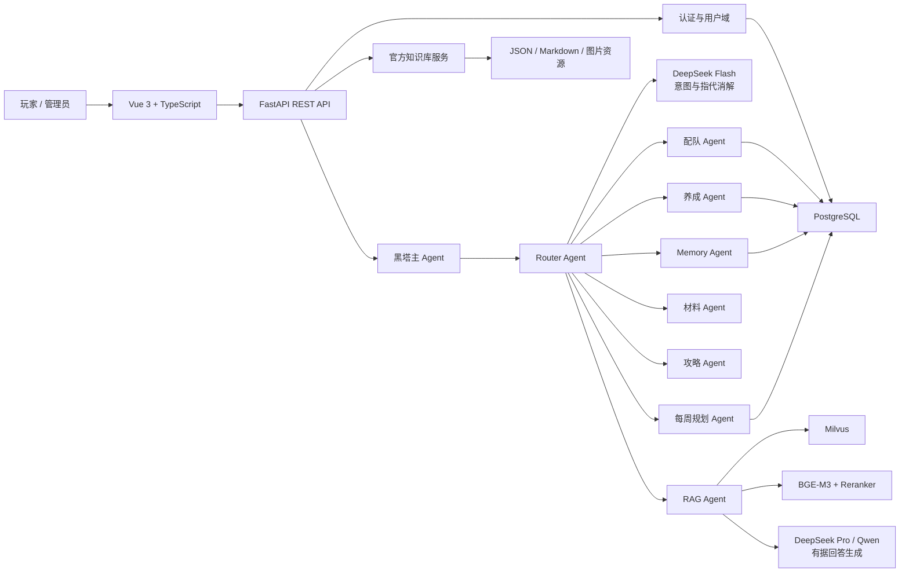
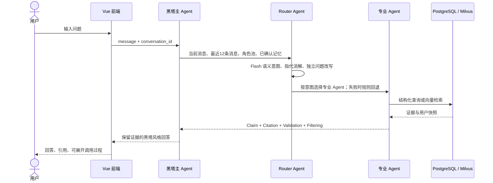
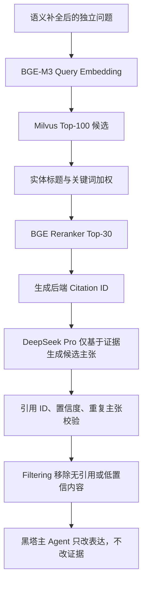
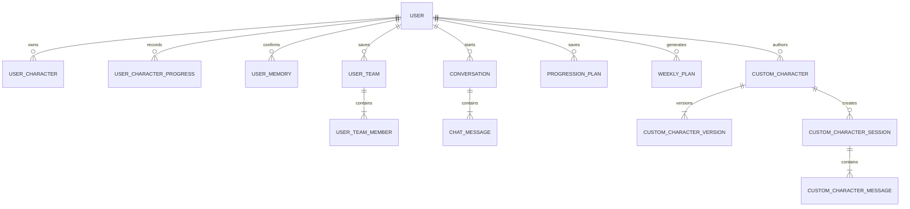

# 系统架构与流程图

本文档对应毕业设计“系统设计与实现”章节，可直接作为论文图表底稿。

## 1. 总体架构

## 2. Multi-Agent 调用

Router 当前注册 `conversation`、`conversation_recall`、`knowledge_qa`、`team_recommendation`、`character_build`、`strategy_summary`、`material_query`、`memory`、`weekly_plan`、自定义角色创作与配队。剧情意图暂由 RAG Agent 安全降级。

系统采用混合式 Multi-Agent：Router、RAG 与自定义角色抽取使用大模型完成语义决策或有据生成；配队、养成、材料和每周规划 Agent 使用确定性业务工具计算并验证结果。确定性 Agent 不依赖生成式模型猜测数值，因此响应更快，但仍具备独立目标、上下文、工具调用、校验和统一输出协议。

## 3. RAG 流程

## 4. 核心 ER 图

## 5. 数据边界

- 官方角色、光锥、遗器、物品与怪物进入官方目录和 Milvus collection。
- 用户角色池、练度、队伍、养成方案、会话和记忆进入 PostgreSQL，并按 `user_id` 隔离。
- 玩家自定义角色使用独立版本表与社区接口，不写入官方 RAG。
- LLM 输出不能直接修改记忆、队伍、养成方案或公开版本；写操作必须由用户或管理员显式触发。
